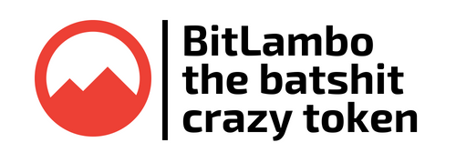

# Yet another ICO is live, get in before it's too late!

| Planning        | Development           | Launched!           |
| :-------------: |:-------------:|:-------------:|
| Why are we late to the ERC20 token party I hear you ask? We've been planning this ICO (or Inital Coin Offering) since Vitalik Buterin was writing "hello world" websites.      | We've been working on BitLambo (symbol - BITBO) for at least 2 hours. While other ICO creators were making hundreds of millions of dollars we have been copying and pasting code to make a smart contract from Ethereum.org. Not to mention making this 1 page website! | You can now send POA to [get your BitLambo right away](https://wizard.oracles.org/invest?addr=0x34f7690f15B4a3c466A86BAFcBD55250E15E9605&networkID=99). Yep, no waiting period like other ICOs, ain't nobody got time for that. |

## Based on POA Network Ethereum Sidechain

All the cool kids base their new cryptocurrencies on Ethereum. BitLambo has more lines of code than Bancor, which means it's worth even more than their tiny $3,500,000 per line of code. Did we mention blockchain!? Buzzzzzzzword!

## Inspired by Bitcoin

BitLambo has the best of both worlds, it's not just a plain old boring decentralized token based on Ethereum. BitLambo is twice as good as Bitcoin, having 42,000,000 BitLambo coins (double Bitcoins 21,000,000) and 0 decimal places (who needs those anyway!?) - making them extremely extremely extremely valuable. Right? Right!?

## Copy Pasta

We promise BitLambo coin isn't a copy paste job like the thousands of other alternative cryptocurrencies that magically appeared within a week or two. Actually, make that a PINKY PROMISE!

## Guaranteed token value

Unlike with every other token sale on the market, I can guarantee here and now that the value of BitLambo will not (in fact, can not) reduce during or after the ICO. Since these tokens aren't worth anything to start with, there's nowhere to go but up!

But remember—this is a completely honest ICO, which means I don't want anyone to mistakenly expect the value of the tokens to go up, either. They're called the batshit crazy token for a reason.

## Whitepaper

You can view our extensive whitepaper [here](#), but make sure you have plenty of time on your hands since it's quite detailed, especially compared to the average ICO. The next step on our whitepaper is to get listed on every exchange in the universe.

## How to get involved

By now you've wasted enough time reading about the great features of BitLambo coin. You're more than likely close to giving us your private keys by now, so let's get to the important stuff.
The BitLambo ICO will end 24 hours after you visit the site (just kidding, that countdown is just to spread FOMO!) or we raise the target of 0,1 POA, because we've worked out through our very complex and thorough calculations that that's exactly how many POA we need to hire a junior developer straight out of college for a weeks work. A total of 29.400.000 BitLambo coins will be distributed through a faucet and airdrop if we reach the target. If the target is not met, we'll have to pay the junior developer in the remaining BitLambo coins from the ICO, oops.

[To participate, send POA here](https://wizard.oracles.org/invest?addr=0x34f7690f15B4a3c466A86BAFcBD55250E15E9605&networkID=99) (all good wallets will tell you how much gas to pay, minimum POA should be 0,000000023809524 for one BitLambo coin) to the address above in order to receive BitLambo. This crowdsale is a smart-contract, your BitLambo tokens will automatically be linked to the POA address you send from. Don't send POA from an exchange, send from a wallet that you fully control - any wallet that supports ERC20 tokens will work with BitLambo. But be quick, lots of people are FOMOing lately.

After you've participated in the ICO, simply add a new token in any good wallet (such as myetherwallet):

```
Name: BitLambo
Symbol: BITBO
Decimal places: 0
Network: POA Network https://poa.net

Token Distribution:
  Tier 1:           4.200.000     (@ 0,000000023809524 POA/Token, totaling 0,1 POA)
  Airdrop/Faucet:   29.400.000
  Founder:          4.200.000
  Total Supply:     42.000.000
```

## About

Okay okay, "we" and "our" has been mentioned a lot so far. There's actually only 1 person behind this once in a lifetime ICO, who would've guessed?

| David Maillard <br>CFO (Chief FOMO Officer)         | We want you! <br>CIO (Chief Investment Officer)            |
| :-------------: |:-------------:|
| David has been developing software for years, with 39 years blockchain experience. Actually, that's just his age. https://twitter.com/MaillardDavid | Without people to sell ponzi coins, BitLambo coins to, nobody would make any money in ICO land. Buy in at the ICO, sell after ICO (since BitLambo is an ERC20 token, it should be easy to get it on exchanges fairly soon). Simples. |

## Fun facts

| 2         | 156            | 95227         | 1337      |
| :-------------: |:-------------:|:-------------:|:-------------:|
|Hours spent|Lines of code|Buzzwords used|Millionaires BitLambo coin will make|


## Frequently asked questions

### Wait… is this a joke? Is it a scam?

Neither! This is real—and it's 100% transparent. You're literally giving your money to someone on the internet and getting completely useless tokens in return.

There are no “roadmap,” no “products,” and no “experts.” It's just you, me, your hard-earned POA, and my shopping list.

### Why are you doing this?

Who knows? Maybe it's because I lost money in the GDAX flash crash. Maybe I got inspired by the guy who crowdfunded the potato salad. Maybe I'm just way too bored and need a better hobby.

### What can I do with BitLambo?

BitLambo is a standard ERC20 token, so you can hold it and transfer it.<br>
Other than that… nothing. Absolutely nothing.<br>
(Seriously, don't buy this. Why are you even still reading these?)

### Will BitLambo be traded on any exchanges?

I hope so. You have no idea how much I hope so.<br>
In fact, if it does get picked up by any of the major exchanges, I promise to use some of the ICO proceeds to constantly and incessantly manipulate the market.

### Will there be more chances to buy BitLambo?

That's a great question! It totally depends on how the ICO performs in the beginning. If I don't make enough money to buy at least one flat-screen television, I'll probably keep the ICO open longer than initially stated.

### How do I get a refund for the tokens I bought?

You're kidding, right?

---

## Join the discussion in our [BitLambo Telegram](https://t.me/joinchat/DqnU2RIxEDlVlxLdLFrn7g)

_While BitLambo is a bit of fun, yes - it's actually a real ERC20 token. <br>You need to be connected on the POA Network `https://core.poa.network` using [Metamask](https://metamask.io/) client to invest into the crowdsale. [View transactions on POA Explorer](https://poaexplorer.com/address/0x34f7690f15B4a3c466A86BAFcBD55250E15E9605), [View the source code](#)._

<!--[Telegram](https://www.google.com) / [WhatsApp](https://www.google.com) / [Bitcointalk](https://www.google.com) / Medium / Twitter-->

© 2018 Some random person on the internet<br>
All Right Reserved, including the right not to give back your money.
